## > A BEAUTIFUL DESCENT 🌄

After listening to Darknet Diaries podcast episodes LoD,MoD and Phrack ,
I had a spark of curiosity of how old hackers used to operate back then in the 80s and 90s and with the need to preserve the hacker culture here is a curated list of my top picks on the best zines and textiles to revisit:


It's all created with one goal:

```sh
# theFridayEveningStuff -- weekends 
- To create a cyber world where storytelling,labs,music & hacker history combine into one immersive system for understanding how digital world works.

- It's all about skill building + hacker vibes 🗣️

||__|| ACK THE PLANET
||  ||


The culture: what it has always been:

Curiosity
→ terminal experimentation
→ weird books
→ underground zines
→ late-night obsession
→ 2:13 AM CRT terminal glow
→ OverTheWire wargames
→ Python scripting to automate the boring stuff
→ self-built projects
→ technical depth
→ systems understanding

It was all about understanding systems deeply enough that they slowly revealed their logic under the glow of a terminal screen at 2:13 AM.

```

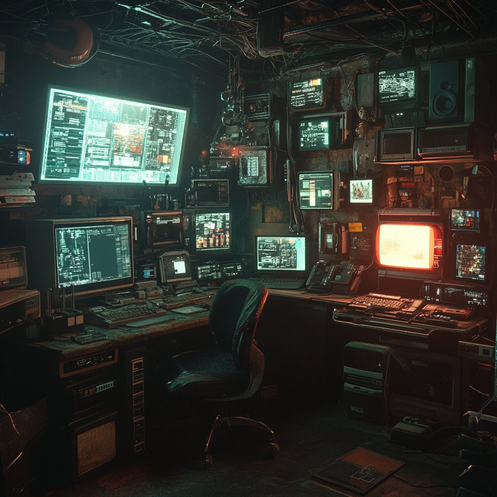

## - ZINES 📰

---

### (a)Phrack

Hacker exploit culture, technical writeups, underground research

All about:
- Culture
- Unix
- underground essay 

the most influential & gateway to hacking


---

#### (b) 2600: The Hacker Quarterly 
phone phreaking, hacking stories, grassroots tech rebellion.

All about :
- phreaking
- Hacking Culture 
- privacy
- telecom systems

It's a cultural counter piece.

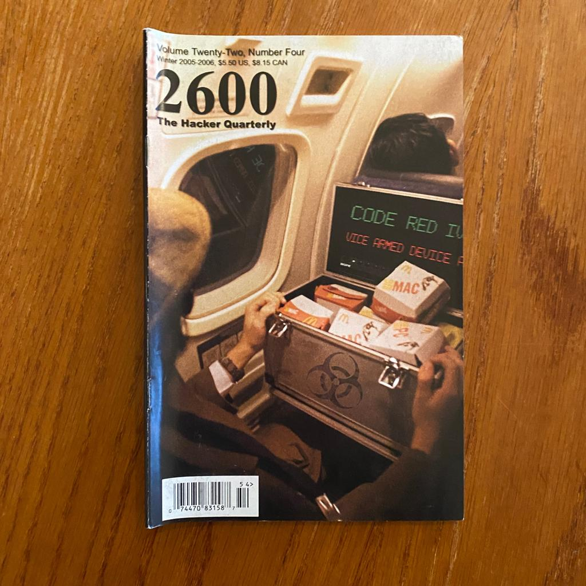


#### (c) TAP (Technological American Party )

Early phreaking newsletter 


#### (d) Hack-Tic

A Dutch hacker magazine 

All about:
- politics 
- internet 
- security 
-

#### (e) Mondo 2000

Cyberpunk tech magazine 
- hacking
- futuristic 
- psychedelia
// A digital aesthetic 


#### (f) cDc publications
Linked to cult of deadcow 
- essays
- digital rights 
- Hacking Culture 
- Underground humour


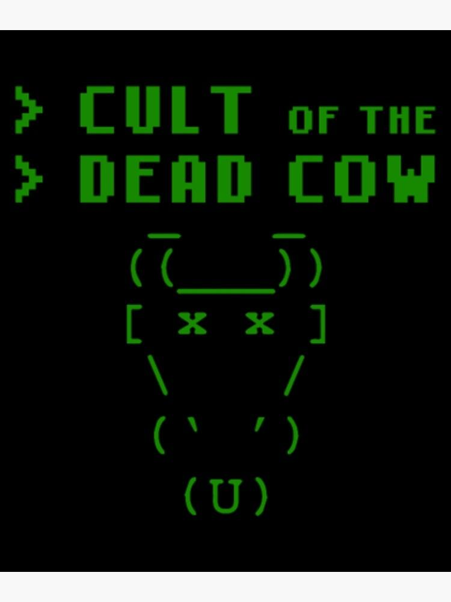

---

## - BBS TEXTFILES & ARCHIVES 📂

#### (a) textfiles
Such as:
- essays 
- security concepts
- networking docs 
- scene culture 
// textfiles.com has the archives -- contains underground hacker history

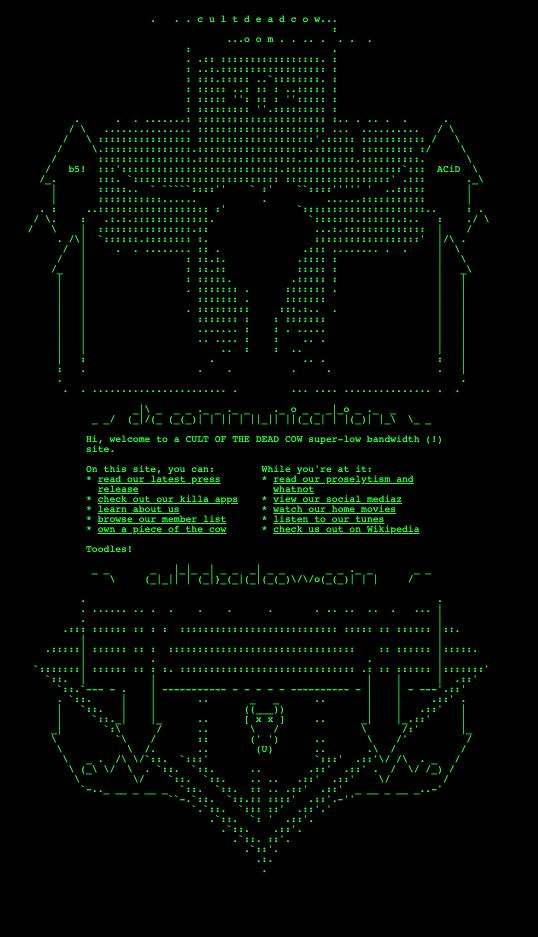


--

## - TECHNICAL BOOKS & HACKER READS 📖

#### (a) The C programming language ©️
// for UNIX culture ANSI

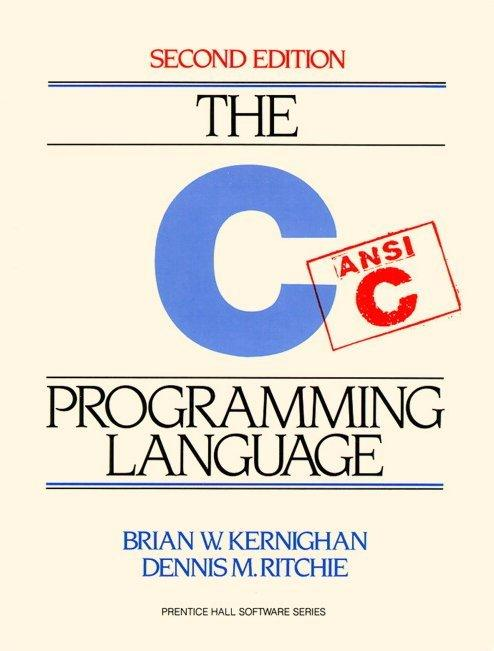

#### (b)The UNIX programming Environment 
// Unix philosophy & tooling

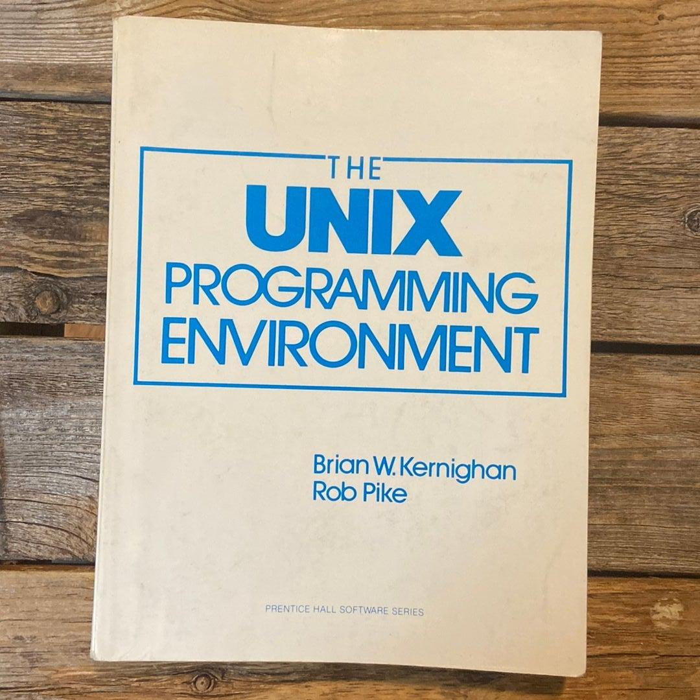

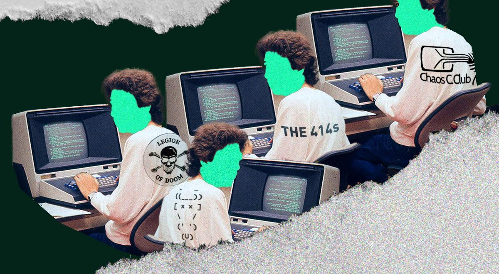

#### (c) Advanced programming in the UNIX environment 
// System level learning 

#### (d)TCP/IP illustrated by Richard W.Steven
// Networking - the Hacker Arena


#### (e)Manuals 
- RFCs // protocol documents eg TCP/IP


---

## - CULTURE BOOKS 📚 

##### (a) Hackers by Steven Levy

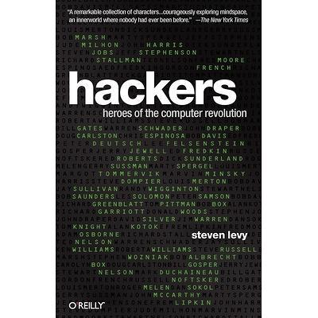

##### (b)Hacker Crackdown by Bruce Sterling 

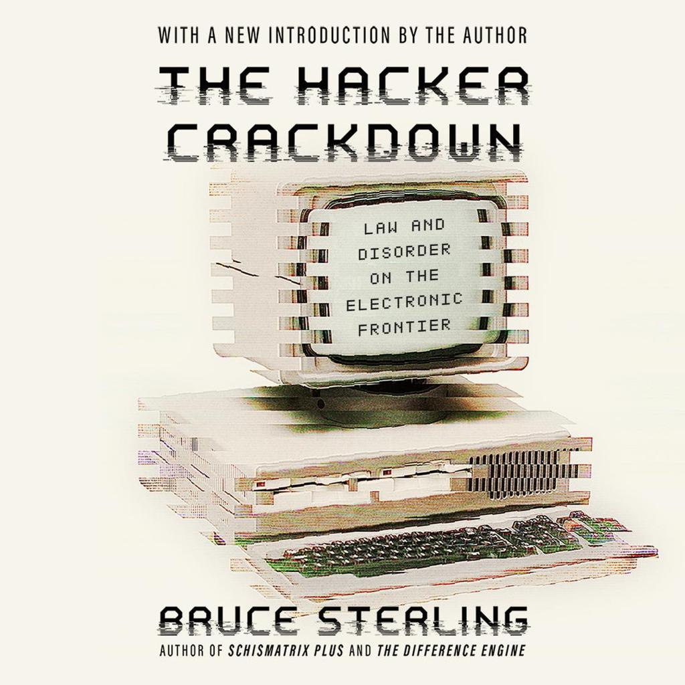

##### (c) Cuckoo's egg by Clifford Stoll 

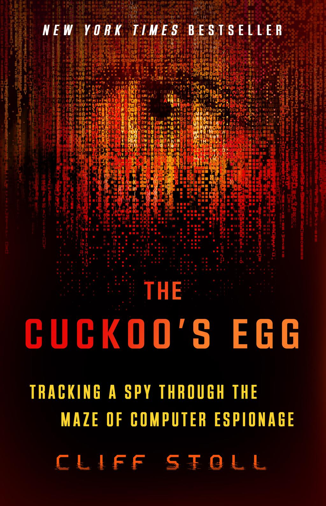


---

## - CYBERPUNK 🎆🏙️

// shaped hacker imagination & identity


#### - Novels

##### (a) Neuromancer - William Gibson 
// Most influential 


##### (b)Snow Crash - Neal Stephenson 
// Virtual worlds ,hacker imagination 

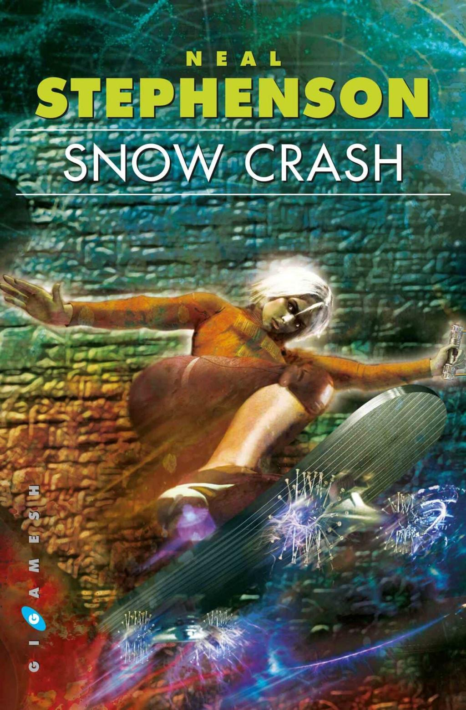


### - Manga comics

##### (a) Akira - Katsuhiro Otamo

// Massive influence 


##### (b) Ghost in the Shell - masamura 
- Network 
- AI
- Surveillance 
- identity 


##### (c) Cyberpunk Music 🎧📻

Emotion , imagination, nostalgia eh Memory Reboot
Categories:
- Synthwave
- futuresynth
- Retrowave


---

## 🖥️ TERMINAL / WARGAME CULTURE


## - OverTheWire 🎧💻

 // Connection to old CRT monitors 
 
Terminal literacy, systems thinking, binary exploitation, patience through challenge.

##### (1) Bandit 

terminal dojo - like breathing in Unix 

##### (2) Natas

Web broken trust boundaries

##### (3) Krypton 

Security as math defending information 

##### (4) Leviathan 

Reverse engineering binaries instincts.
// How does this executable think?

##### (5) Narnia 

Binary exploitation - a gateway to hacker territory 
Buffer overflows and she'll code

##### (6) Behemoth

Intermediate binary exploitation 
CRT @ 2:13 am

##### (7) Utumno 

Advanced binary exploitation + linux internals 
// Less handholding // elf behaviour 
Harder : understanding execution env deeply

##### (8) Maze

Complex exploit navigation:
- patience 
- explanatory analysis 
- deep territories

##### (9) Vortex

Networking + low level exploitation + weird systems.
Custom python scripts 
Extreme underground Unix weird energy 

##### (10) Manpage 
##### Documentation literacy + Unix philosophy 
Reading documentation deeply & obsessively 
Understanding Unix tools

##### (11) Drifter 
Advanced low level systems interaction 
Into weird syscalls and memory maps, kernel adjustments thinking + systems programming thinking.

 ##### (12) Formula One

Multistage investigations+ lateral thinking 
Hacker puzzle solving 
Exploration 

##### (13) Semtex (offline)

Exploitation lab work 
Old exploit Dev labs 
Local binary experimentation 
Crash analysis 

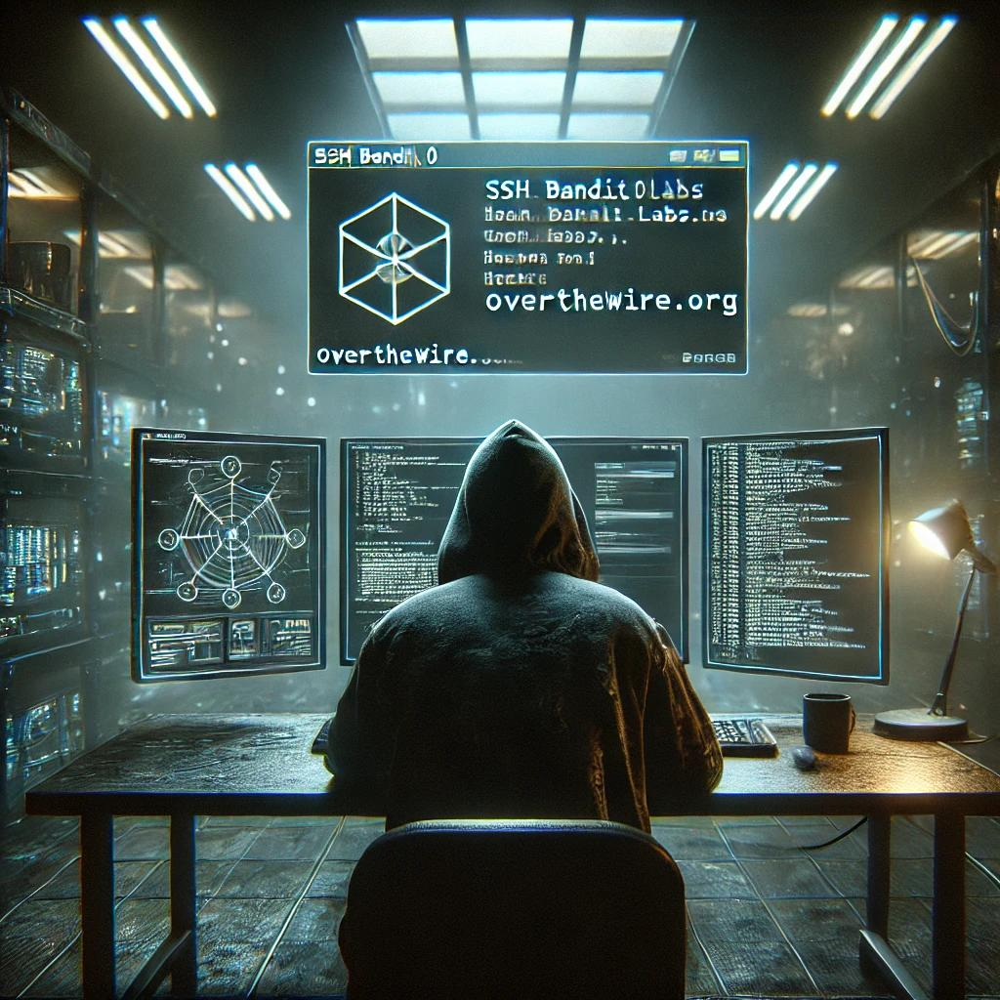

##### // ALL THATS NEEDED FOR ABOVE
- patience 
- systems literacy 
- debugging mindset
- investigative thinking 
- comfort with discomfort 
- terminal fluency 
- respect for complexity
& you can navigate anything 


// Even with SOC path hacker spirit still alive through 

```json
{
OvertheWire wargames // main Dojo,
PicoCTF,
HackTheBox + Portswigger
}

```

### CODING

May languages of choice :
- python
```py

import os

```


- C #include <studio.h>

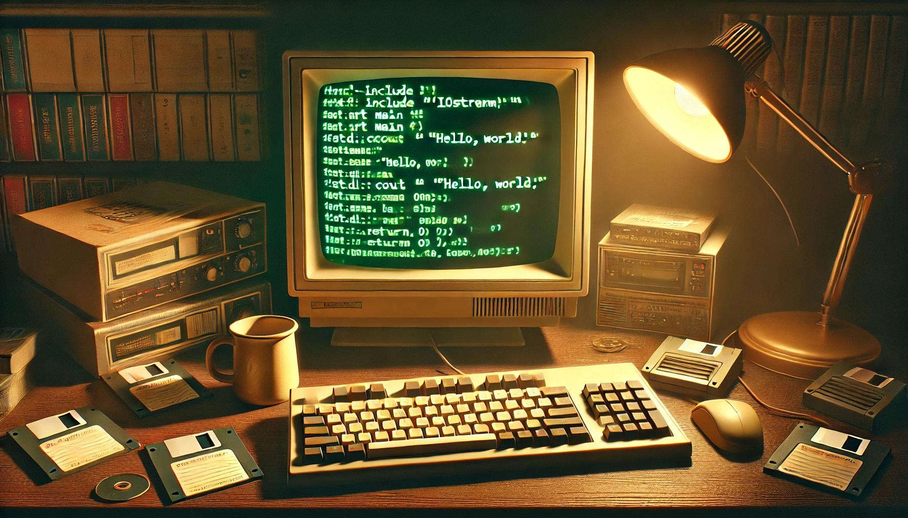
